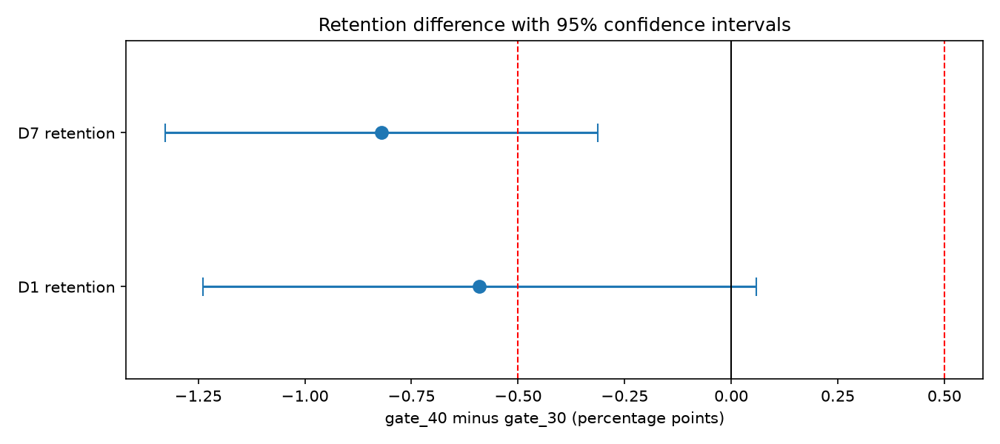

# Cookie Cats A/B Test: Should the First Gate Move from Level 30 to 40?

**Live app:** deploy this repo on [Streamlit Community Cloud](https://share.streamlit.io) with main file path `app/streamlit_app.py` (Python 3.12), then paste the URL here.
**Decision memo:** [reports/decision_memo.md](reports/decision_memo.md) · **Pre-analysis plan:** [reports/pre_analysis_plan.md](reports/pre_analysis_plan.md)

## Result in one paragraph

Moving the first progression gate from level 30 to level 40 **lowered 7-day retention**, so the
recommendation is to keep the gate at level 30. Across 90,189 randomly assigned players, D7
retention fell from 19.02% to 18.20%: a difference of **-0.82 percentage points** (-4.3% relative),
95% CI -1.33 to -0.31 pp, p = 0.0016, still significant after Holm correction (p = 0.0031).
Bootstrap, permutation and Bayesian analyses all agree - the Beta-Binomial model puts the
probability that gate_40 is truly better at about 0.1% - and rounds played show no practically
meaningful difference. The main caveat is a **borderline sample ratio mismatch** (p = 0.0086
against an assumed 50/50 split), which is reported rather than ignored.



## Business question

Cookie Cats is a match-three mobile puzzle game. As players progress they hit **gates**, points
where they must wait or make an in-app purchase to continue. New players were randomly assigned to
a first gate at level 30 (control, the current version) or level 40 (treatment). Gates drive both
pacing and monetization, so the team needs to know whether pushing the first one 10 levels later
keeps more players or loses them.

## Key findings

- **D7 retention (primary metric):** 19.02% vs 18.20%, **-0.82 pp** (-4.3% relative),
  95% CI -1.33 to -0.31 pp, p = 0.0016, Holm-adjusted p = 0.0031. About **82 fewer day-7 returners
  per 10,000 installs**.
- **D1 retention (secondary):** -0.59 pp, 95% CI -1.24 to +0.06 pp, p = 0.074. Same direction,
  not significant - and with an MDE of 0.93 pp, "not significant" does not mean "no effect".
- **Robustness:** bootstrap 95% CI -1.34 to -0.31 pp (gate_30 ahead in 99.9% of 10,000 resamples);
  permutation p about 0.0016 (0.00162 from 2,000,000 hypergeometric draws); Bayesian
  P(gate_40 better) about 0.1%, expected loss 0.82 pp if gate_40 ships.
- **Engagement:** no practically meaningful difference in rounds played. One physically impossible
  value (49,854 rounds) drove nearly the whole apparent gap in means: -1.16 rounds with it
  (p = 0.38), -0.04 without it (p = 0.95). Mann-Whitney is borderline (p = 0.0502) with a
  negligible effect size. The visible pattern is *where* players stop: gate_30 players cluster just
  after 30 rounds.
- **Validity:** SRM chi-square p = 0.0086 - flagged at 0.01, not at the 0.001 threshold most
  platforms alarm on, and spread evenly across userid deciles. Reported as a limitation.

## Method

| Step | What I did | Tools |
|---|---|---|
| Pre-analysis plan | Hypotheses, metrics, alpha, practical threshold and decision rules committed **before** any analysis | Markdown, Git |
| SQL exploration | Data quality, group sizes, retention summary, percentiles, buckets, CTEs, window functions, INNER and CROSS JOINs | DuckDB |
| Cleaning and EDA | Flagged (not deleted) one impossible value, 3,994 zero-round players and 111 inconsistent rows; visualized the skew | pandas, seaborn |
| Validity and power | SRM chi-square plus a per-decile diagnostic, MDE, required sample size, power curve | SciPy, statsmodels |
| Retention tests | Two-proportion z-tests by hand, then cross-checked with statsmodels and a 2x2 chi-square; Wald CIs; Holm correction | SciPy, statsmodels |
| Robustness | Bootstrap (10,000 resamples), permutation test (10,000 shuffles plus 2,000,000 exact draws), Bayesian Beta-Binomial with expected loss | NumPy |
| Engagement | Welch's t-test with and without the outlier, Mann-Whitney U with probability of superiority, bootstrap median CI, winsorized means | SciPy |
| Pitfalls | Simulated post-treatment filtering bias and daily peeking, with a calibrated boundary checked on fresh simulations | NumPy |
| App | A/B analyzer and sample-size planner: SRM check, CI chart, Bayesian probability and expected loss | Streamlit |

Two pitfalls are demonstrated rather than asserted:

- **Post-treatment filtering.** Comparing only players with 40+ rounds shows -1.78 pp, more than
  twice the valid -0.82 pp. In a simulation where the treatment has *zero* true effect on retention
  and only raises rounds played by 25%, the same filter manufactures a -3.34 pp "effect".
- **Peeking.** Across 2,000 simulated A/A tests, checking daily for 14 days raises the false
  positive rate from 5.0% to 21.6%. A boundary calibrated at |z| = 2.632 brings it back to about
  5% on a fresh set of simulations.

## Limitations

- The intended allocation ratio is undocumented, so the SRM check assumes a 50/50 design.
- No revenue or purchase data, even though gates are a monetization lever.
- The measurement window for `sum_gamerounds` is unclear (one week or 14 days, depending on source).
- No install dates (no time-trend check) and no pre-assignment player attributes (no fair segments).
- The test could reliably detect only D7 changes of about 0.73 pp or larger; detecting the 0.5 pp
  practical threshold would need about 95,700 players per group.

## Repository structure

```
CookieCats-A-B-Test/
├── app/
│   ├── streamlit_app.py            # the web app
│   └── requirements.txt            # minimal packages for deployment
├── data/
│   ├── raw/
│   │   └── cookie_cats.csv         # downloaded data (NOT committed to Git)
│   └── processed/                  # created by the notebooks (only the summary is committed)
│       └── summary_by_version.csv  # tiny file the app reads (committed)
├── notebooks/
│   ├── 01_sql_exploration.ipynb
│   ├── 02_cleaning_eda.ipynb
│   ├── 03_experiment_validity_power.ipynb
│   ├── 04_retention_tests.ipynb
│   ├── 05_bootstrap_permutation_bayesian.ipynb
│   ├── 06_engagement_tests.ipynb
│   └── 07_pitfalls_simulations.ipynb
├── reports/
│   ├── figures/                    # 11 PNG charts
│   ├── pre_analysis_plan.md
│   └── decision_memo.md
├── sql/                            # 8 .sql files, run against a DuckDB view over the CSV
├── .gitignore
├── README.md
└── requirements.txt                # full local environment
```

## How to reproduce

1. Clone the repository and create a Python 3.12 virtual environment.
2. `pip install -r requirements.txt`
3. Download `cookie_cats.csv` from
   [Kaggle](https://www.kaggle.com/datasets/yufengsui/mobile-games-ab-testing) into `data/raw/`.
4. Run notebooks `01` to `07` in order (each one reads what the previous one wrote).
5. Run the app: `streamlit run app/streamlit_app.py`

Every notebook prints a **checkpoint** next to each result, so a rerun can be verified number by
number. Formula-based results reproduce exactly; simulated values move slightly with library
versions and are reported with their simulation error.

## Data source

Cookie Cats A/B test dataset, via Kaggle (originally from a DataCamp project): 90,189 players,
one row each, with version, rounds played and D1/D7 retention flags.

Note on process: the pre-analysis plan was written and committed before the analysis was run, and
the commit history shows that order. This dataset is public and widely analyzed, so the plan was
written to practice the discipline rather than to protect a genuinely unseen result.

## How I used AI tools

I used an AI assistant to scaffold notebook structure and to draft explanatory prose, then verified
every statistical claim myself: each z-test is calculated by hand before being cross-checked against
statsmodels and a chi-square test, the MDE is derived from the formula and confirmed with
statsmodels, retention rates are computed in both SQL and pandas and must match, the permutation
p-value is produced two independent ways, and the simulation-calibrated peeking boundary is
validated on fresh simulations. The interpretation, the decision rules and the memo are my own.
